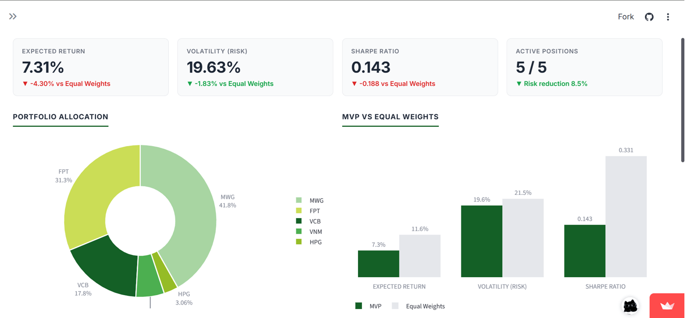
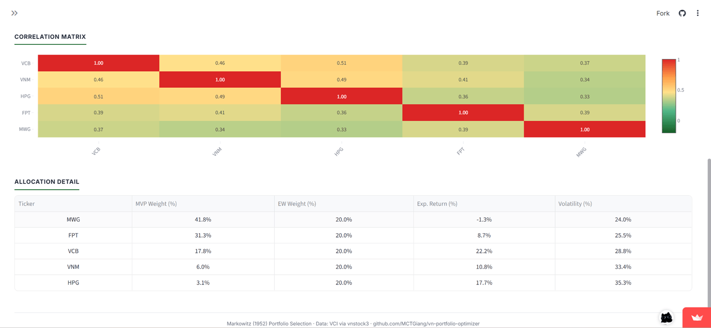

# VN Portfolio Optimizer

[](https://github.com/MCTGiang/vn-portfolio-optimizer/actions/workflows/tests.yml)
[](https://www.python.org/downloads/)
[](https://opensource.org/licenses/MIT)
[](https://stats.uptimerobot.com/spxJeakm9r)

**English** | [Tiếng Việt](./README.vi.md)

> Portfolio optimizer for Vietnamese VN30 stocks — reduces volatility 8-25% versus equal-weighted baselines

[//]: # (Badges will be added on Day 9 - Testing & CI/CD)


🚀 **Try it live at mctgiangproject1.streamlit.app →** [](https://mctgiangproject1.streamlit.app)

---

## Project Motivation: Democratizing Quantitative Finance in Vietnam

Despite comprising 99% of Vietnam's 13.6 million brokerage accounts (as of May 2026), retail investors are systematically locked out of data-driven investing. Existing quantitative portfolio optimization tools are either restricted by institutional paywalls or lack localized support for Vietnamese market mechanics (VN30 tickers, HOSE calendars, VND pricing).

I built this project to bridge that information gap. By providing access to the same risk-adjusted mathematical frameworks (Markowitz, 1952) used by institutional funds, this tool empowers retail investors to move beyond social media speculation and make mathematically sound, data-driven portfolio decisions.

## The Solution

**VN Portfolio Optimizer** is a free, open-source web application that brings institutional-grade quantitative modeling to the Vietnamese equity market. By implementing Markowitz's Modern Portfolio Theory (MPT), the tool allows users to select subsets of the VN30 index and dynamically generates:

- **Optimal asset allocation**: Computes the Minimum Variance Portfolio to minimize mathematical risk.
- **Benchmark Evaluation**: Backtests the optimized portfolio against a naive, equal-weighted ($1/N$) baseline.
- **Interactive risk analytics**: Visualizes asset relationships through dynamically generated correlation heatmaps and diversification metrics.
- **Exportable reports** in Excel (3 sheets) and PDF formats.

### Measurable Impact

The optimization engine was validated across distinct portfolio configurations using five years of historical market data (01/01/2021–20/08/2026).

| Portfolio | Vol Reduction |
|-----------|---------------|
| 2 correlated stocks (VCB + BID) | 3.8% |
| 5 diverse sectors | 8.5% |
| 10 VN30 stocks | 12.2% |
| **Full VN30 basket (29 stocks)** | **25.9%** |

Key Finding: The system quantitatively confirms that MPT principles hold strong in the Vietnamese market. **Volatility reduction scales predictably with the number and sectoral diversity of holdings**, proving the mathematical value of the tool for retail investors.

## Key Features

- 📊 **Minimum Variance Portfolio** — Sequential Least Squares Programming (SLSQP) solver with no-short-sell constraints (0 ≤ wᵢ ≤ 1, Σwᵢ = 1)
- 📈 **Interactive dashboard** — Donut allocation chart, MVP vs Equal Weights comparison, correlation heatmap, and portfolio KPI cards (Return, Volatility, Sharpe Ratio, Active Positions)
- 🇻🇳 **Vietnamese-first data** — vnstock KBSQuote as primary source, yfinance as automatic fallback for cloud deployment reliability
- 💾 **Report exports** — Excel with 3 sheets (Allocation / Metrics / Correlation) and PDF with 2-page layout including all charts
- 🌏 **Bilingual UI** — Vietnamese and English toggle for both interface labels and export outputs
- ☁️ **Cloud-ready** — Deployed on Streamlit Community Cloud with auto-DB initialization on cold start

## Architecture

### Data Flow

The system fetches OHLCV data from Vietnamese market APIs, transforms it into a returns matrix, and applies quadratic optimization to find the minimum variance portfolio.

`````mermaid
flowchart LR
    subgraph Sources ["Data Sources"]
        A1[vnstock KBSQuote]
        A2[yfinance .VN suffix]
    end
    
    subgraph Storage ["Persistent Storage"]
        DB[(SQLite<br/>portfolio.db)]
    end
    
    subgraph Pipeline ["Processing Pipeline"]
        L[data_loader.py<br/>ETL + Fallback]
        F[features.py<br/>Returns + Winsorize]
        M[portfolio_metrics.py<br/>μ, Σ, Sharpe]
        O[optimizer.py<br/>SLSQP Solver]
    end
    
    subgraph UI ["User Interface"]
        S[Streamlit Dashboard<br/>Plotly Charts]
        E[Excel Export]
        P[PDF Export]
    end
    
    A1 -->|primary| L
    A2 -.->|fallback| L
    L -->|INSERT OR IGNORE| DB
    DB --> F
    F --> M
    M --> O
    O --> S
    S --> E
    S --> P
    
    style A1 fill:#e8f5e9,stroke:#146026,stroke-width:2px
    style A2 fill:#fff3e0,stroke:#e65100,stroke-width:2px
    style DB fill:#e3f2fd,stroke:#1565c0,stroke-width:2px
    style O fill:#146026,color:#fff,stroke:#146026,stroke-width:2px
    style S fill:#80c433,color:#000,stroke:#146026,stroke-width:2px
`````

**Key design decisions:**

- **Multi-source fallback**: vnstock is primary (native VN market data), yfinance is fallback for reliability
- **SQLite over Postgres**: Zero setup overhead, sufficient for VN30's ~40K rows, embedded in the app
- **Layer separation**: Each module has a single responsibility — data_loader knows about APIs, features knows about time series, optimizer knows about SLSQP
- **Cached queries**: Streamlit's `@st.cache_data(ttl=3600)` avoids redundant DB queries during a session

### Code Structure

Module dependencies follow a strict bottom-up hierarchy — no circular dependencies, no cross-layer imports.

`````mermaid
graph TD
    subgraph App ["Application Layer"]
        APP["app/app.py<br/><i>Streamlit UI + Charts</i>"]
    end
    
    subgraph Core ["Analytics Core"]
        OPT["src/optimizer.py<br/><i>SLSQP + MVP solver</i>"]
        MET["src/portfolio_metrics.py<br/><i>Portfolio stats</i>"]
        FEAT["src/features.py<br/><i>Returns + Winsorize</i>"]
    end
    
    subgraph Data ["Data Layer"]
        DL["src/data_loader.py<br/><i>vnstock + yfinance</i>"]
        DB[("SQLite<br/>portfolio.db")]
    end
    
    APP --> OPT
    APP --> MET
    APP --> FEAT
    APP --> DL
    OPT --> MET
    OPT --> FEAT
    MET --> FEAT
    FEAT --> DL
    DL --> DB
    
    style APP fill:#80c433,color:#000,stroke:#146026,stroke-width:2px
    style OPT fill:#146026,color:#fff,stroke:#146026,stroke-width:2px
    style DL fill:#2e7d32,color:#fff,stroke:#146026,stroke-width:2px
    style DB fill:#e3f2fd,stroke:#1565c0,stroke-width:2px
`````

The dependency graph is a directed acyclic graph (DAG) — this is important because:

- **Testable in isolation**: Lower layers can be tested without mocking upper layers
- **Refactoring safety**: Changes in `data_loader.py` propagate up, but not sideways
- **Clear reasoning**: New contributors can understand the codebase top-down or bottom-up

### Optimization Flow

The full flow from user selection to result rendering takes ~1.2 seconds on cold cache, ~50ms on warm cache.

`````mermaid
sequenceDiagram
    autonumber
    actor U as User
    participant UI as Streamlit App
    participant Cache as st.cache_data
    participant DL as data_loader
    participant DB as SQLite
    participant F as features
    participant M as metrics
    participant O as optimizer
    
    U->>UI: Select 5 VN30 stocks
    UI->>Cache: Check cache key
    
    alt Cache hit
        Cache-->>UI: Return cached result
    else Cache miss
        UI->>DL: load_from_db(tickers, dates)
        DL->>DB: SELECT OHLCV
        DB-->>DL: DataFrame per ticker
        DL-->>UI: Combined DataFrame
        
        UI->>F: build_returns_matrix()
        F-->>UI: Returns matrix (N days × M assets)
        
        UI->>M: expected_returns + cov_matrix
        M-->>UI: μ vector + Σ matrix
        
        UI->>O: min_variance_portfolio()
        Note over O: SLSQP iterates until convergence<br/>~500ms for 5 assets
        O-->>UI: Optimal weights
        
        UI->>Cache: Store result (TTL=1h)
    end
    
    UI-->>U: Render KPI + Donut + Bar + Heatmap
`````

## Results — Project 1

| Portfolio | # Assets | MVP Return | MVP Vol | EW Vol | Vol Reduction | Sharpe (MVP) |
|-----------|----------|------------|---------|--------|---------------|--------------|
| VCB + BID (high correlation) | 02 | 8.98% | 24.51% | 25.47% | 3.8% | 0.183 |
| 5 diverse sectors | 05 | 7.10% | 19.64% | 21.46% | 8.5% | 0.132 |
| 5 banks (same sector) | 05 | 12.06% | 22.65% | 24.84% | 8.8% | 0.334 |
| 10 VN30 stocks | 10 | 10.39% | 18.66% | 21.25% | 12.2% | 0.316 |
| **29 VN30 (full)** | **29** | **7.25%** | **15.62%** | **21.08%** | **25.9%** | **0.176** |

**Key finding:** Volatility reduction scales with diversification—from 3.8% for 2 highly-correlated stocks to 25.9% for the full VN30 basket. This empirically validates the theoretical foundation of Modern Portfolio Theory in the Vietnamese market.

> _Note: Sharpe ratios reflect the challenging 2022–2023 VN market conditions (VN-Index drawdown of ~30%). The system's core value lies in demonstrating measurable diversification benefit, not maximizing risk-adjusted returns._

📊 **Reproduce these numbers:** Run [`notebooks/90_final_benchmark_results.ipynb`](./notebooks/90_final_benchmark_results.ipynb) or see [`reports/benchmark_results_20260821.csv`](./reports/benchmark_results_20260821.csv).

## Screenshots

<table>
  <tr>
    <td></td>
    <td></td>
  </tr>
  <tr>
    <td align="center"><em>KPI cards and allocation donut chart</em></td>
    <td align="center"><em>Correlation heatmap for portfolio analysis</em></td>
  </tr>
</table>

## Tech Stack

**Core:** Python 3.11+ • SciPy (SLSQP) • Pandas • NumPy • Streamlit • Plotly

**Data:** vnstock (primary) • yfinance (fallback) • SQLite

**Testing & CI:** pytest • pytest-cov • GitHub Actions

**Code Quality:** black • ruff

**Export:** openpyxl (Excel) • fpdf2 + matplotlib (PDF with Vietnamese support)

## Quick Start

### Try the live demo (recommended)

Visit **[mctgiangproject1.streamlit.app](https://mctgiangproject1.streamlit.app)** — no installation required.

### Run locally

```bash
git clone https://github.com/MCTGiang/vn-portfolio-optimizer.git
cd vn-portfolio-optimizer
pip install -r requirements.txt
streamlit run app/app.py
```

For detailed setup instructions, troubleshooting, and dev environment configuration, see **[Setup Guide](./docs/setup.md)**.


## Documentation

- **[Setup Guide](./docs/setup.md)** — Detailed installation, troubleshooting, dev setup
- **[Architecture Decisions](./docs/architecture.md)** — 6 ADRs documenting design rationale
- **[Roadmap](./docs/roadmap.md)** — 4-phase research project overview
- **[Development Log](./docs/development-log.md)** — Sprint retrospective and learnings
- **[Changelog](./CHANGELOG.md)** — Version history following Keep a Changelog format
- **[System Status](https://stats.uptimerobot.com/spxJeakm9r)** — Live monitoring of Streamlit deployment
- **[Deployment Testing Report](./docs/deployment-testing.md)** — Browser compatibility, mobile responsiveness, network resilience
- **[Notebook Guide](./notebooks/README.md)** — Reproducible analysis notebooks organized by category
- **[Full Report (Vietnamese)](./reports/)** — Complete project report with detailed methodology

## About the Author

**Mai Công Trà Giang** — IT Engineering student at Hanoi University of Science and Technology (HUST), 
pursuing a dual-degree program with Foreign Trade University (FTU). This project is Phase 1 of a 
2-year initiative to build production-grade quantitative investment tools for the Vietnamese market.

**Connect:** [GitHub @MCTGiang](https://github.com/MCTGiang) · [LinkedIn](https://linkedin.com/in/mctgiang)


## License

MIT License — see [LICENSE](./LICENSE) for details.

Copyright © 2026 Mai Công Trà Giang

