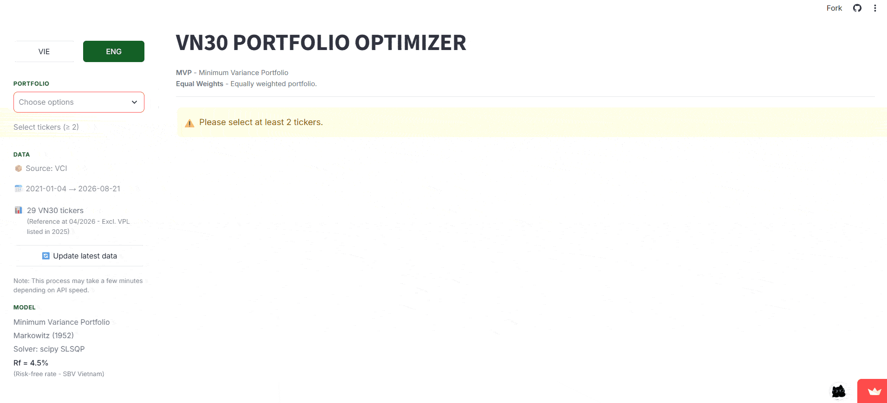

# VN Portfolio Optimizer

[English](./README.md) | **Tiếng Việt**

> Công cụ tối ưu hóa danh mục đầu tư cho cổ phiếu VN30 — giảm 8-25% biến động so với phân bổ đồng đều



🚀 **Dùng thử tại mctgiangproject1.streamlit.app →**[](https://mctgiangproject1.streamlit.app)
---

## Về dự án

VN Portfolio Optimizer là công cụ tối ưu hóa danh mục đầu tư miễn phí, mã nguồn mở, được xây dựng riêng cho nhà đầu tư cá nhân Việt Nam. Áp dụng Lý thuyết Danh mục Hiện đại (Modern Portfolio Theory) của Harry Markowitz (1952) trên dữ liệu 29 mã cổ phiếu VN30.

**Điểm khác biệt so với công cụ khác:**

- ✅ Hỗ trợ chuẩn dữ liệu Việt Nam (VN30, HOSE, giá VND)
- ✅ Giao diện song ngữ Việt-Anh
- ✅ Xuất báo cáo Excel + PDF với font tiếng Việt đầy đủ
- ✅ Deploy trên cloud, không cần cài đặt

## Kết quả kiểm nghiệm

Dữ liệu backtest 2021-2026 (1,346 phiên giao dịch):

| Danh mục | Số mã | MVP Vol | EW Vol | Giảm rủi ro |
|----------|-------|---------|--------|-------------|
| VCB + BID (tương quan cao) | 2 | 24.51% | 25.47% | 3.8% |
| 5 mã đa ngành | 5 | 19.64% | 21.46% | 8.5% |
| **29 mã VN30 (đầy đủ)** | **29** | **15.62%** | **21.08%** | **25.9%** |

Kết luận: Càng nhiều mã và tương quan càng thấp, hiệu quả đa dạng hóa càng cao — đúng với lý thuyết MPT.

## Hướng dẫn nhanh

### Cách 1: Dùng bản demo online (khuyến nghị)

Truy cập **[mctgiangproject1.streamlit.app](https://mctgiangproject1.streamlit.app)** — không cần cài đặt.

### Cách 2: Chạy trên máy local

```bash
git clone https://github.com/MCTGiang/vn-portfolio-optimizer.git
cd vn-portfolio-optimizer
pip install -r requirements.txt
streamlit run app/app.py
```

App sẽ tự động mở tại `http://localhost:8501`.

## Lộ trình phát triển

Dự án là Giai đoạn 1 của kế hoạch nghiên cứu 4 giai đoạn về đầu tư định lượng cho thị trường chứng khoán Việt Nam. Xem chi tiết trong **[Roadmap](./docs/roadmap.md)**.

## Tài liệu

- **[Hướng dẫn cài đặt (Setup Guide)](./docs/setup.md)** — Cài đặt chi tiết, khắc phục sự cố
- **[Quyết định kiến trúc (Architecture)](./docs/architecture.md)** — 6 ADRs
- **[Lộ trình chi tiết (Roadmap)](./docs/roadmap.md)** — Kế hoạch 4 giai đoạn
- **[Nhật ký phát triển (Dev Log)](./docs/development-log.md)** — Sprint retrospective
- **[Changelog](./CHANGELOG.md)** — Lịch sử phiên bản

📝 Xem [English README](./README.md) để có đầy đủ Architecture diagrams và Tech Stack breakdown.

## Tác giả

**Mai Công Trà Giang** — Sinh viên VB2 CNTT, Đại học Bách Khoa Hà Nội.

**Liên hệ:** [GitHub @MCTGiang](https://github.com/MCTGiang) · [LinkedIn](https://linkedin.com/in/mctgiang)

## Giấy phép

MIT License — xem [LICENSE](./LICENSE).

---